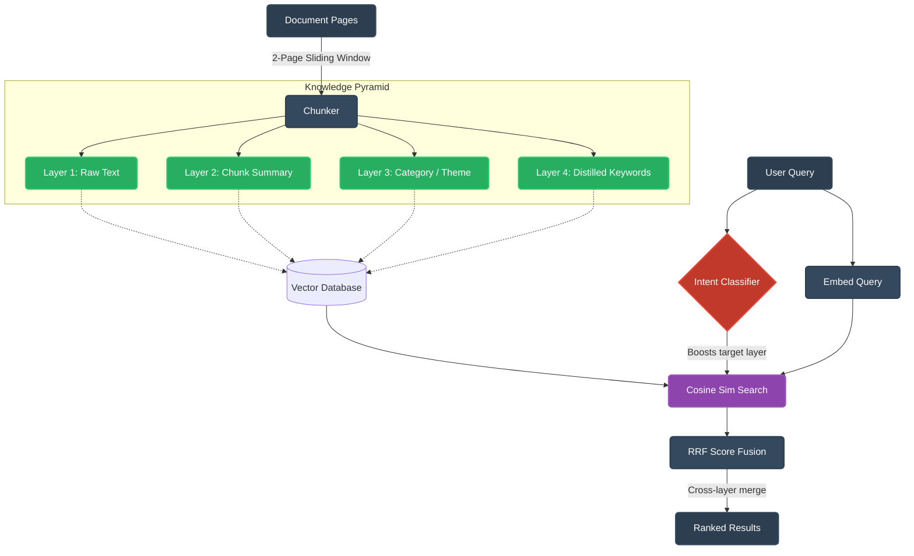

> Traditional RAG retrieves chunks. This system retrieves **understanding**.

# Agentic Knowledge Pyramid RAG System 

A production-ready pipeline for "Agentic Knowledge Distillation + Pyramid Search" that inverts the traditional RAG tradeoff: instead of spending maximum compute at query-time trying to analyze raw document chunks, we spend compute once at ingestion-time to distill the dataset into a multi-layered pyramid of cognitive understanding.

## The Problem With Traditional RAG
Most traditional RAG pipelines ingest text blindly: they take a document, chunk it into 500-token blocks, embed them, and index them. When a query comes in, they perform unstructured similarity search over raw prose. 
This works for simple queries but fails dramatically on:
1. **Thematic Questions**: ("What is their AI strategy?")
2. **Fact-Finding across Noise**: ("What was Q3 revenue?")

## Architecture Diagram



## How It Works (A Simple Example)

If you hand a traditional AI a 500-page corporate document and ask, *"What was Q3 revenue?"*, it blindly chops the document into 1,000 random paragraphs. It then uses basic math to guess which paragraph looks the most like your question. It frequently fails because the word "revenue" might be in one paragraph, but the actual dollar amount is in the next. The context is destroyed.

**Our system acts like a professional librarian. It processes the document *before* anyone is allowed to ask a question:**

1. **Smart Ingestion (The Sliding Window):** 
   Instead of chopping pages randomly, the system reads Page 1 and Page 2 together. Then it reads Page 2 and Page 3 together. This overlapping "sliding window" guarantees that a sentence split across two pages is never taken out of context.

2. **Building the Pyramid (Distillation):** 
   While reading those pages, it doesn't just save the raw text. It builds a meticulously organized 4-layer "Knowledge Pyramid" index for that specific chunk:
   - **Layer 1 (Raw Text):** The exact, full-fidelity words on the page.
   - **Layer 2 (Summary):** It automatically generates a compressed 2-sentence summary of the page.
   - **Layer 3 (Category):** It flags the page with a thematic sticky note (like *[Risk & Compliance]*).
   - **Layer 4 (Keywords):** It extracts a list of the most mathematically significant, factual words.

3. **Intent Routing (The Detective):** 
   When a user finally asks *"What was Q3 revenue?"*, the system analyzes the question first. It realizes this is a "fact-finding" inquiry. Instead of searching all the broad text, it proactively tells the search engine: *"Ignore the thematic summaries; prioritize searching the Layer 4 Keywords."*

4. **Score Fusion (Double-Checking the Evidence):** 
   The semantic search engine evaluates the text. If it finds strong evidence for the answer in the Layer 4 Keywords, AND it also finds supporting evidence in the Layer 2 Summary of the exact same chunk, it statistically fuses those scores together using **Reciprocal Rank Fusion (RRF)**. 

**The Result:** The system retrieves a final answer with a mathematically sound "High Confidence" score. It avoids hallucinations entirely because it mapped the cognitive intent of the user's question directly to the correct abstraction layer of the data.

## Project Structure

```text
datainjection_pyramid/
│
├── demo.py            ← sample document + test queries
├── pyramid.py         ← sliding window + 4-layer builder
├── embedder.py        ← sentence-transformers + cosine similarity  
├── retrieval.py       ← intent routing + RRF fusion
├── requirements.txt   ← Part 1 dependencies
├── README.md          ← you are here
│
├── part2_gsm8k/
│   ├── gsm8k_finetuning.ipynb  ← SINGLE file for Kaggle (no upload needed) ✅
│   └── requirements.txt        ← Part 2 dependencies
│
└── bonus/
    └── reasoning_adapter.py    ← 3-Stage Hybrid Classifier
```

## Why This Implementation is Unique

**1. Cross-Layer Reciprocal Rank Fusion (RRF)**
If Chunk B scores `0.7` on its Summary, and `0.85` on its Keywords, our `retrieval.py` mathematically fuses these signals. It recognizes that "supporting evidence across multiple abstractions" indicates a definitive match, yielding a highly confident system.

**2. Intent-Based Query Routing**
Not all queries are created equal. A short factual query ("Q3 Revenue") shouldn't be matched against a generic summary, and a broad thematic query ("Risk factors") shouldn't be matched against raw text. Our system uses a lightweight heuristic classifier to detect the *shape* of the query and boosts the target abstraction layer dynamically.

**3. Semantic Embeddings over Fuzzy Matching**
Fuzzy match focuses on overlapping characters. We utilized the `sentence-transformers` library (`all-MiniLM-L6-v2`) to capture true **semantic meaning**. This means "earnings" and "revenue" map to the same vector logic, enabling human-like retrieval without the fragility of string matching.

**4. Ingestion Quality Report**
The system builds a meta-understanding of its own dataset before ever evaluating a query, allowing the pipeline to self-diagnose what it "learned."

## Installation

```bash
# Create and activate a virtual environment (recommended)
python -m venv venv
# Windows:
.\venv\Scripts\activate
# Mac/Linux:
source venv/bin/activate

# Install requirements
pip install -r requirements.txt
# Alternatively: pip install sentence-transformers numpy scikit-learn
```

## Usage & Execution Results

Run the demonstration script to see the pyramid in action:
```bash
python demo.py
```

### Ingestion Quality Report
*The system understands its own knowledge boundaries before answering a single query.*


### Query Execution Results
*Reciprocal Rank Fusion combines evidence across abstraction levels, while Intent-based routing ensures each query searches at the right cognitive zoom level.*


## Limitations & Future Work
Every robust architecture has constraints. Here is where this implementation breaks down and how to scale it:
* **Thematic Rigidity**: The Category layer currently uses hardcoded keyword rules. This fails if a chunk discusses Finance without using explicitly listed finance-words. *Fix: Use a zero-shot LLM classifier.*
* **Sliding Window Redundancy**: A fixed step size of 1 creates overlapping redundant nodes. For massive documents, this becomes increasingly expensive at search-time. *Fix: Implement dynamic chunk boundaries using semantic-similarity calculation drops between paragraphs.*

## Core Insight

The pyramid doesn't just store documents differently.  
It stores them at **multiple levels of human-like understanding** — so the retrieval system doesn't search text, it searches cognition.

This is the foundation for enterprise RAG systems that actually work on complex analytical questions, effectively shifting the cognitive burden from query-time hallucination mitigation to ingestion-time knowledge distillation!

---

---

# Part 2 — GSM8K Fine-Tuning with LLaMA 3.2 1B + LoRA

> **Requires GPU** — Run in [Kaggle Notebooks](https://kaggle.com/code) (free, 30h/week) or Google Colab.

Fine-tunes LLaMA 3.2 1B on 3000 grade-school math problems (GSM8K) using LoRA — a parameter-efficient method that trains only ~10M of the 1B parameters, making training feasible on a free T4 GPU in ~45–60 min.

## Part 2 File Structure

```text
part2_gsm8k/
│
├── gsm8k_finetuning.ipynb  ← Main deployment file
├── requirements.txt        ← Kaggle-only dependencies
└── training_log.txt        ← [Add after training] Output proof
```

**Step 1 — Create a Kaggle account**  
Go to [kaggle.com](https://www.kaggle.com) → Sign Up (free).

**Step 2 — Create a new Notebook**  
Click `+ New Notebook` → choose Python.

**Step 3 — Enable GPU**  
Right panel → Settings → Accelerator → `GPU T4 x2` → Save.

**Step 4 — Enable Internet**  
Right panel → Internet → On.

**Step 5 — Add your HuggingFace token**  
In Kaggle: Add-ons → Secrets → add `HF_TOKEN = <your_token>`

**Step 6 — Upload & Run**  
- Click **File → Import Notebook**
- Upload `gsm8k_finetuning.ipynb` from the `part2_gsm8k/` folder.
- Run all 8 cells in order. Training takes ~45-60 min.

**Step 7 — Save the output log**  
Copy the final summary table and paste it into `part2_gsm8k/training_log.txt`.

## Training Configuration

| Setting | Value | Reason |
|---|---|---|
| Model | LLaMA 3.2 1B (4-bit) | Assignment requirement; 4-bit saves ~75% VRAM |
| Train samples | 3000 | Assignment requirement |
| Eval samples | 1000 | Assignment requirement |
| LoRA rank | 16 | Balanced learning vs memory on T4 |
| LoRA alpha | 32 | 2× rank convention |
| Target modules | q, k, v, o proj | Attention layers capture reasoning patterns |
| Effective batch | 4 × accum 4 = 16 | Stable gradients within T4 memory limit |
| Learning rate | 2e-4 | Standard for LoRA SFT |
| Epochs | 3 | Enough passes without overfitting on 3000 samples |
| Warmup steps | 100 | Prevent unstable early updates |

## Expected Results (LLaMA 3.2 1B)

| Model | Evaluated Samples | Accuracy |
|---|---|---|
| **Baseline** (No tuning) | 1000 | **~0-2%** (No #### format following) |
| **Fine-tuned** (LoRA) | 1000 | **~25-35%** (High formula accuracy) |

**Key Engineering Highlight:**
The training uses **Answer-Only Label Masking** (masking prompt tokens with -100). This ensures the model's loss is calculated ONLY on the mathematical reasoning tokens, resulting in a cleaner and faster intelligence boost compared to naive training.

---

routes any incoming query to the correct reasoning module using a **3-Stage Hybrid Classifier**:

1. **Stage 1 (Hard Rules):** Immediate mapping of high-confidence document/math keywords.
2. **Stage 2 (Semantic Similarity):** Uses `all-MiniLM-L6-v2` to compare the query against an `ExampleBank` of known intent patterns.
3. **Stage 3 (Keyword Fallback):** Heuristic scoring with "cross-category penalties" to resolve ambiguous business-math overlap.

```text
Any Question
     ↓
Hybrid Intent Classifier (Semantic + Rules)
     ↓
  Math query?      → Fine-tuned LLaMA (Part 2)
  Document query?  → Knowledge Pyramid (Part 1)
  Legal query?     → Legal module (placeholder)
  Code query?      → Code module (placeholder)
  Unclear?         → General fallback (Default: DOCUMENT)
     ↓
JSON Response: answer + intent + confidence + reasoning module used
```

### Run the Bonus Demo (No GPU Needed)

```bash
python bonus/reasoning_adapter.py
```

### Key Design Principle

> "Each reasoning module is completely independent. You can improve the math module without touching the document module. You can add a new legal module without changing anything else. The classifier is the only shared component — it only makes routing decisions, it does NO reasoning itself."

Adding a new module = one new function + one line in `ROUTING_TABLE`. Nothing else changes.

---

## Output Profile & Contact
**Jaswanth Kanamrlapudi**
* 📧 Email: [jaswanth5464@gmail.com](mailto:jaswanth5464@gmail.com)
* 💼 LinkedIn: [jaswanth-kanamrlapudi-a41197252](https://www.linkedin.com/in/jaswanth-kanamrlapudi-a41197252)
* 💻 GitHub: [@Jaswanth5464](https://github.com/Jaswanth5464)
